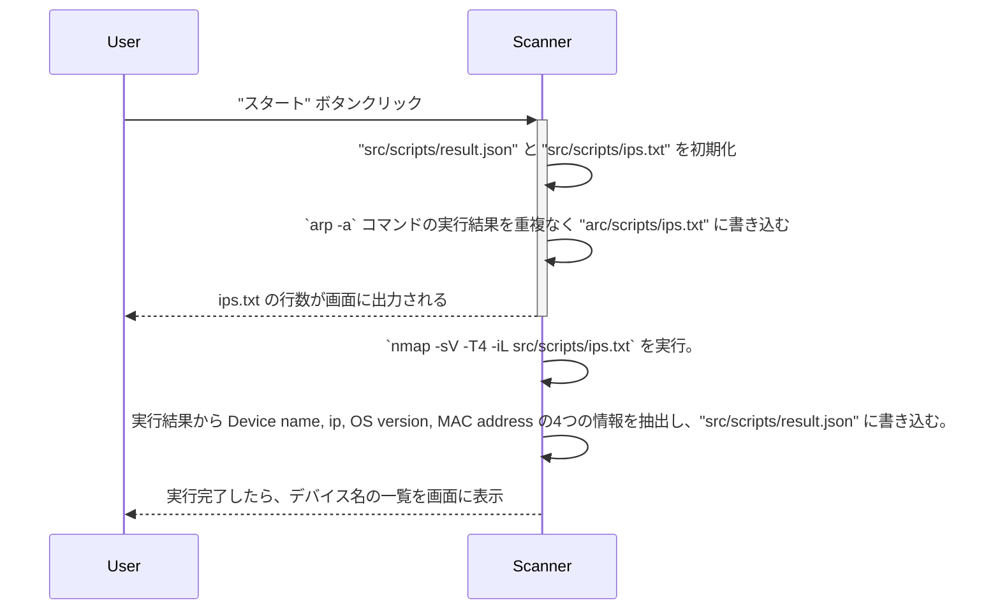
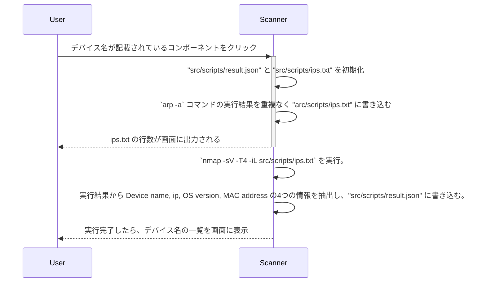

## シーケンス図
### 最初の実行


### デバイス詳細の表示


## 利用手順
1. `yarn start` 実行し、アプリケーションを起動する。起動が完了したことを確認後、以下のコマンドを実行。その際、パスワードを求められする。デバイスのロックを解除するときと同じパスコードを入力し、エンターキーを押下。(入力中の値は見えないが入力できている)
```
sudo nmap -O -T4 -iL src/scripts/results/ips.txt -oX src/scripts/results/results_nmap_O.xml
```

:::note info
nmap のリファレンスより、[法的通知事項](https://nmap.org/man/ja/man-legal.html)を確認すると ｢独自開発の実行可能インストーラに統合/組込/集約する｣ ことは派生著作物に該当するとされている。有料契約するか、問い合わせることで派生著作物の確認をしてもらえるとのことだが、本アプリケーションでは事前準備ということで、アプリケーションに組み込まずに分けて実行した。上記のコマンド自体は nmap に用意されているオプションを指定しているだけである。
:::

2. src/scripts/results/results_nmap_O_{i}.json の情報を元に、アプリで利用するマスターデータファイルの src/scripts/results/result.json に追記していく以下のファイルを実行
``` zsh
./src/scripts/edit_result.sh
ts-node src/scripts/extract_and_clean_data.ts
```

3. ブラウザに戻り、｢スタート｣ ボタンを押下してアプリケーションを実行し、結果を確認する。

## 備考
本アプリケーションは表示形式をわかりやすくする目的でAppleのロゴを引用していますが、本アプリケーションは、独立した出版物であり、Apple Inc.が認定、後援、その他承認したものではありません。